# A Series

 

### A Major

???+ info "A Major Chord"

    {width="25" align="right"}

    (A) - C# - E

    The A Major chord is a triad formed from a root (A), a major third (C#), and a perfect fifth (E). This chord is one of the most basic and commonly used chords in Western music, known for its bright, happy, and stable sound. The A Major chord is versatile and appears in a wide range of musical genres, from rock and pop to classical and folk. Its straightforward structure makes it a foundational chord in many progressions, often used to establish a strong tonal center in a key.

     

    | Open Chord | Barre Chord |
    | :---: | :---: |
    | 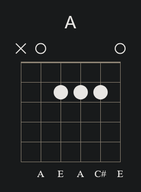{align="center"} | 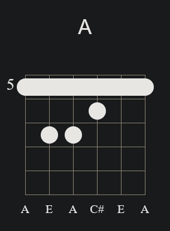{align="center"} |

 

### A Minor

???+ info "A Minor Chord"

    {width="25" align="right"}

    (A) - C - E

    The A Minor chord is a triad formed from a root (A), a minor third (C), and a perfect fifth (E). The minor third (C) gives this chord its distinctive, melancholic sound compared to the brighter sound of A Major.

     

    | Open Chord | Barre Chord |
    | :---: | :---: |
    | 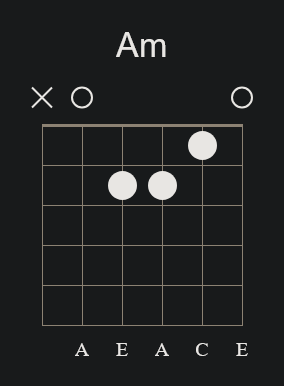 | 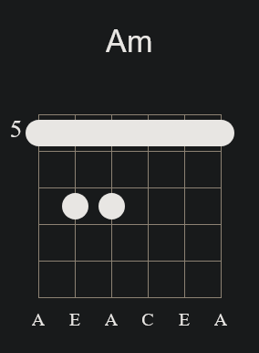 |

 

### A7

???+ info "A7 Chord"

    {width="25" align="right"}

    (A) - C# - E - G

    The A7 chord, also known as the A dominant seventh, is a four-note chord (or tetrad) formed from a root (A), a major third (C#), a perfect fifth (E), and a minor seventh (G). The minor seventh (G) added to the major triad creates a dominant seventh chord, which has a strong, unresolved sound often used in blues, rock, and jazz to create tension that typically resolves to a major or minor chord.

     

    | Open Chord | Barre Chord |
    | :---: | :---: |
    | 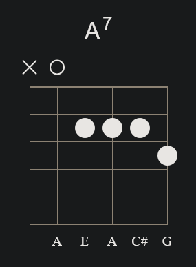 | 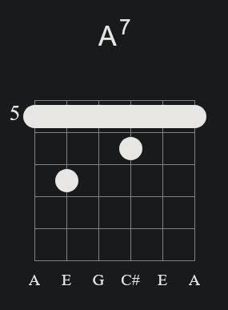 |

 

### Am7

???+ info "Info"

    {width="25" align="right"}

    (A) - C - E - G

    The Am7 chord, also known as A minor seventh, is a four-note chord (or tetrad) formed from a root (A), a minor third (C), a perfect fifth (E), and a minor seventh (G). The addition of the minor seventh (G) to the minor triad gives the chord a warm, slightly melancholic sound, often used in jazz, blues, and various other styles to add emotional depth and complexity to chord progressions.

     

    #### Variant 01

    | Open Chord | Barre Chord |
    | :---: | :---: |
    | 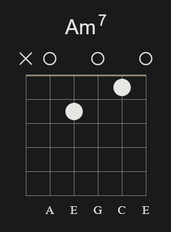 | 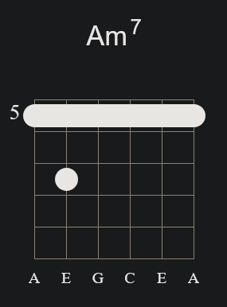 |

     

    #### Variant 02

    | Open Chord | Barre Chord |
    | :---: | :---: |
    | 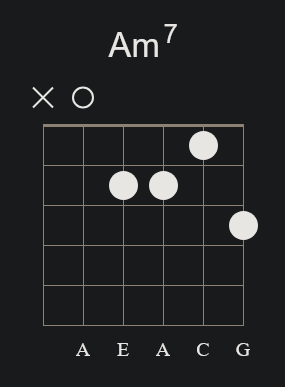 | 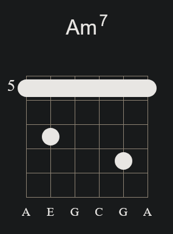 |

 

### Amaj7

???+ info "Amaj7 Chord"

    {width="25" align="right"}

    (A) - C# - E - G#

    The Amaj7 chord, also known as A major seventh, is a four-note chord (or tetrad) formed from a root (A), a major third (C#), a perfect fifth (E), and a major seventh (G#). The major seventh (G#) added to the major triad gives this chord a smooth, lush sound that is commonly used in jazz, pop, and R&B, creating a sense of sophistication and resolution in musical progressions.

     

    | Open Chord | Barre Chord |
    | :---: | :---: |
    | 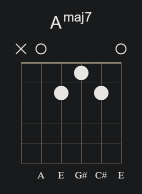 | 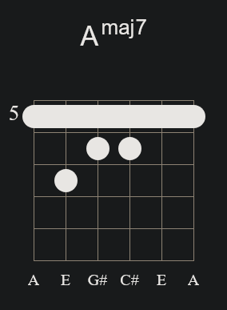 |

 

### Asus2

???+ info "Asus2 Chord"

    {width="25" align="right"}

    (A) - B - E

    The Asus2 chord, also known as A suspended second, is a triad formed from a root (A), a major second (B), and a perfect fifth (E). Like the Asus4 chord, the Asus2 chord lacks a third, which gives it an open, unresolved sound. The absence of the third allows the chord to convey a neutral emotional quality, making it versatile in various musical genres. The Asus2 chord is often used in rock, pop, and folk music to add a fresh, airy sound to chord progressions, and it often resolves to a major or minor chord, typically A major or A minor.

     

    | Open Chord | Barre Chord (N/A) |
    | :---: | :---: |
    | 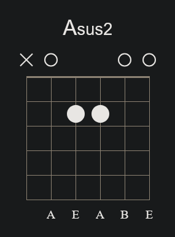 | 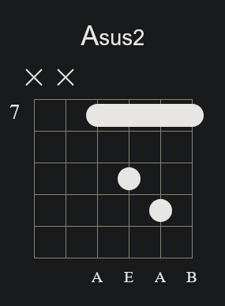 |

 

### Asus4

???+ info "Asus4 Chord"

    {width="25" align="right"}

    (A) - D - E

    The Asus chord, also known as A suspended or A sus4, is a triad formed from a root (A), a perfect fourth (D), and a perfect fifth (E). Unlike major or minor chords, the Asus chord lacks a third, giving it an open, unresolved sound. This lack of a third creates a sense of tension that is often resolved when the chord moves to a major or minor chord (typically A major or A minor). The Asus chord is commonly used in rock, pop, and folk music to create dynamic and expressive chord progressions.

     

    | Open Chord | Barre Chord (N/A) |
    | :---: | :---: |
    | 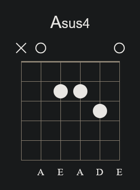 | 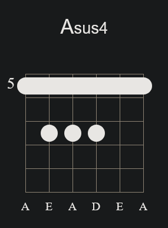 |

 

### A6

???+ info "A6 Chord"

    {width="25" align="right"}

    (A) - C# - E - F#

    The A6 chord is a four-note chord (or tetrad) formed from a root (A), a major third (C#), a perfect fifth (E), and a major sixth (F#). The addition of the sixth (F#) gives this chord a jazzy, somewhat open sound, making it versatile in various musical styles, from jazz to pop.

     

    | Open Chord | Barre Chord |
    | :---: | :---: |
    | 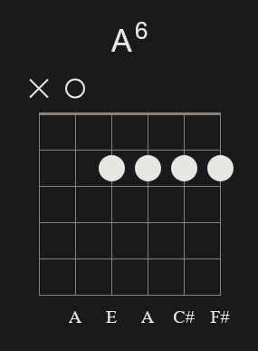 | 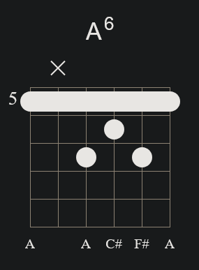 |

 

### Am6

???+ info "Am6 Chord"

    {width="25" align="right"}

    (A) - C - E - F#

    The Am6 chord is a four-note chord (or tetrad) formed from a root (A), a minor third (C), a perfect fifth (E), and a major sixth (F#). The combination of the minor third (C) with the major sixth (F#) creates a rich, somewhat moody sound, often used in jazz, blues, and more complex harmonies to add depth and tension.

     

    | Open Chord | Barre Chord |
    | :---: | :---: |
    | 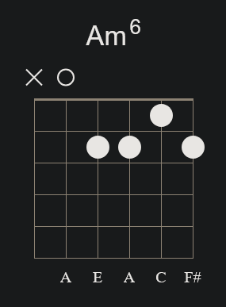 | 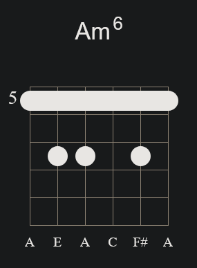 |

 

### A9

???+ info "A9 Chord"

    {width="25" align="right"}

    (A) - C# - E - G - B

    The A9 chord, also known as A dominant ninth, is a five-note chord formed from a root (A), a major third (C#), a perfect fifth (E), a minor seventh (G), and an added ninth (B). The addition of the ninth (B) to the dominant seventh chord (A7) gives this chord a rich, full sound that is commonly used in jazz, blues, and funk to add color and complexity to chord progressions. The A9 chord often resolves to a D major or minor chord, creating a strong harmonic movement.

     

    | Open Chord | Barre Chord |
    | :---: | :---: |
    | 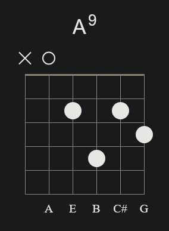 | 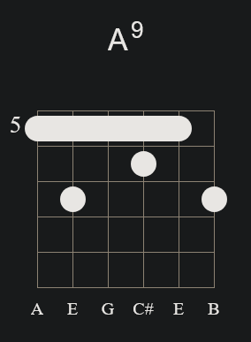 |

 

### Am9

???+ info "Am9 Chord"

    {width="25" align="right"}

    (A) - C - E - G - B

    The Am9 chord, also known as A minor ninth, is a five-note chord formed from a root (A), a minor third (C), a perfect fifth (E), a minor seventh (G), and an added ninth (B). The combination of the minor seventh and the added ninth gives this chord a lush, expressive sound, often used in jazz, soul, and R&B to create a deep, emotional atmosphere. The Am9 chord can add sophistication and richness to minor chord progressions.

     

    | Open Chord | Barre Chord |
    | :---: | :---: |
    | 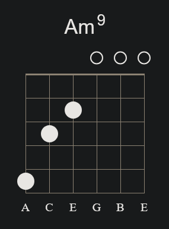 | 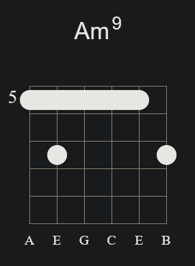 |

 

### Amaj9

???+ info "Amaj9 Chord"

    {width="25" align="right"}

    (A) - C# - E - G# - B

    The Amaj9 chord, also known as A major ninth, is a five-note chord formed from a root (A), a major third (C#), a perfect fifth (E), a major seventh (G#), and an added ninth (B). The combination of the major seventh and the added ninth gives this chord a smooth, sophisticated sound, often used in jazz, pop, and R&B to create a sense of elegance and complexity in harmonic progressions. The Amaj9 chord is particularly effective in conveying a dreamy, uplifting atmosphere.

     

    | Open Chord | Barre Chord |
    | :---: | :---: |
    | 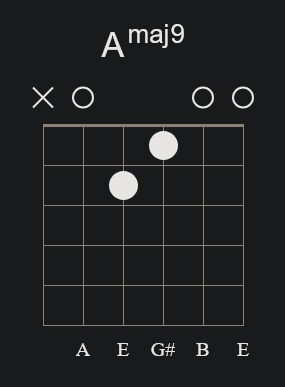 | 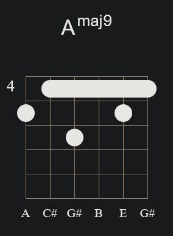 |

 

### A11

???+ info "A11 Chord"

    {width="25" align="right"}

    (A) - C# - E - G - D

    The A11 chord, also known as A dominant eleventh, is a five-note chord formed from a root (A), a major third (C#), a perfect fifth (E), a minor seventh (G), and an eleventh (D). The addition of the eleventh (D) to the dominant seventh chord (A7) creates a rich and complex sound, often used in jazz, funk, and blues to add depth and tension to a progression. The A11 chord has a suspended quality because the eleventh (D) is the same note as the fourth in the A scale, which typically resolves down to the third (C#) in a dominant context.

     

    | Open Chord (N/A) | Barre Chord |
    | :---: | :---: |
    | 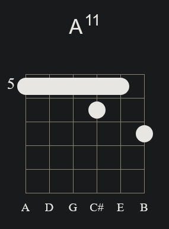 |  |

 

### Am11

???+ info "Am11 Chord"

    {width="25" align="right"}

    (A) - C - E - G - D

    The Am11 chord, also known as A minor eleventh, is a five-note chord formed from a root (A), a minor third (C), a perfect fifth (E), a minor seventh (G), and an eleventh (D). The addition of the eleventh (D) to the minor seventh chord (Am7) creates a lush, expansive sound, often used in jazz, soul, and R&B to add emotional depth and complexity to chord progressions. The Am11 chord has a suspended and open quality due to the eleventh (D), which can give a sense of unresolved tension or a rich harmonic texture when used in various musical contexts.

     

    | Open Chord (N/A) | Barre Chord |
    | :---: | :---: |
    | 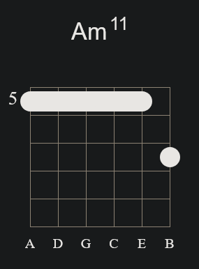 |  |

 

### A(add9)

???+ info "A (add9) Chord"

    {width="25" align="right"}

    (A) - C# - E - B

    The Aadd9 chord, also known as A added ninth, is a four-note chord formed from a root (A), a major third (C#), a perfect fifth (E), and an added ninth (B). Unlike the A9 chord, the Aadd9 does not include the seventh, giving it a more straightforward and open sound. The added ninth (B) gives this chord a fresh, bright character, making it popular in pop, rock, and acoustic music. The Aadd9 chord is often used to add color and richness to a standard A major chord, enhancing the harmonic texture without the tension typically associated with seventh chords.

     

    | Open Chord | Barre Chord (N/A) |
    | :---: | :---: |
    | 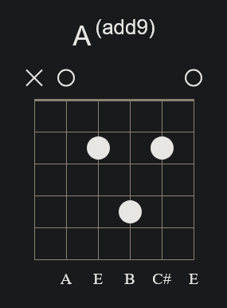 | 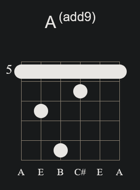 |

 

### Am(add9)

???+ info "Am(Add9) Chord"

    {width="25" align="right"}

    (A) - C - E - B

    The Am(add9) chord, also known as A minor add nine, is a four-note chord formed from a root (A), a minor third (C), a perfect fifth (E), and an added ninth (B). Unlike the Am9 chord, the Am(add9) does not include the seventh, giving it a more straightforward and less complex sound while still retaining a sense of depth and emotion. The added ninth (B) provides a subtle yet expressive color to the standard A minor chord, making it a popular choice in various genres, including folk, rock, and acoustic music, to add a gentle, melodic quality to chord progressions.

     

    | Open Chord | Barre Chord (N/A) |
    | :---: | :---: |
    | 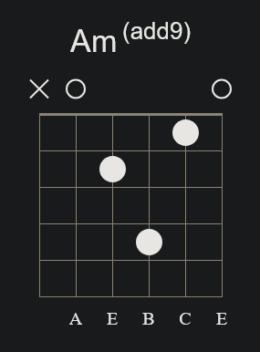 | 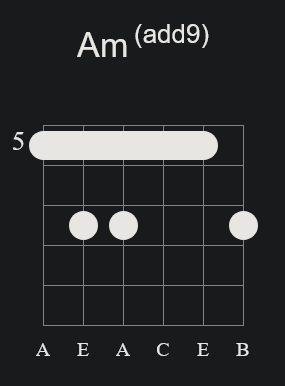 |

 

### Adim

???+ info "Adim Chord"

    {width="25" align="right"}

    (A) - C - E*b*

    The Adim chord, also known as A diminished, is a triad formed from a root (A), a minor third (C), and a diminished fifth (E*b*). This chord has a tense and unresolved sound due to the diminished fifth interval, which creates a feeling of instability and suspense. The Adim chord is often used in classical music, jazz, and other genres to add tension that typically resolves to a more stable chord, such as a major or minor chord.

     

    | Open Chord | Barre Chord |
    | :---: | :---: |
    | 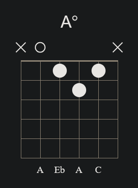 | 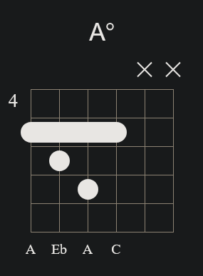 |

 

### A+

???+ info "A+ Chord"

    {width="25" align="right"}

    (A) - C# - F

    The A+ chord, also known as A augmented, is a triad formed from a root (A), a major third (C#), and an augmented fifth (F). The augmented fifth (F) gives this chord its distinctive, unresolved sound, creating a sense of tension and anticipation. The A+ chord is often used in jazz, classical, and some rock music to add a sense of drama or to transition between chords in a progression, typically resolving to a chord a half step up or down.

     

    | Open Chord | Barre Chord (N/A) |
    | :---: | :---: |
    | 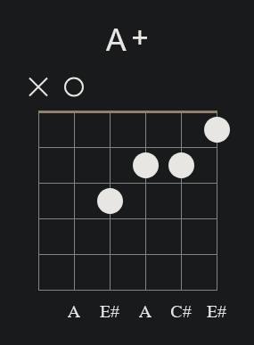 |  |

 

 

 
