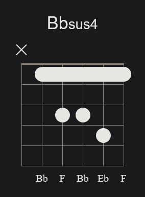

# A# / Bb Series

 

???+ info "Why Use (Flats in) Bb Instead of (Sharps in) A#?"

    - **Ease of Reading:** The key of Bb is simpler to read and write because it involves fewer accidentals (flats) compared to the key of A#, which would have multiple double sharps.

    - **Common Usage:** Bb is a much more common key in Western music. Most music that uses these pitches will be written in Bb rather than A#.

    - **Harmonic Clarity:** Using flats in Bb helps clarify harmonic functions in music theory and aligns better with how scales and chords are traditionally constructed.

 

### Bb Major

??? info "A# / Bb Major Chord"

    {width="25" align="right"}

    (A#) - D - F 

    The A# Major chord is a triad formed from a root (A#), a major third (C##, which is the enharmonic equivalent of D), and a perfect fifth (E#, which is the enharmonic equivalent of F). This chord is bright and uplifting, similar to the A Major chord but a half step higher. The A# Major chord is less common in standard tuning due to its notation complexity. It is used in various styles, offering a strong and stable sound, especially in keys that accommodate sharps.

    Note: In many practical situations, this chord is more commonly referred to as **Bb Major** to simplify the notation, but the structure and sound remain the same.

| Open Chord | Barre Chord |
| :---: | :---: |
| {align="center"} | {align="center"} |

 

### Bb Minor

??? info "Bb Minor Chord"

    (Bb) - Db - F

    The Bb Minor chord is a triad formed from a root (Bb), a minor third (Db), and a perfect fifth (F). This chord has a darker, more somber tone compared to its major counterpart, due to the minor third (Db). The Bb Minor chord is frequently used in various genres such as classical, rock, and jazz to evoke a sense of melancholy or introspection. Its rich and deep sound makes it a popular choice for expressing more emotive and intense musical ideas.

| Barre Chord 1 | Barre Chord 2 |
| :---: | :---: |
| {align="center"} | {align="center"} |

 

### Bb7

??? info "A#7 / Bb7 Chord"

    (Bb) - D - F - Ab

    The Bb7 chord, also known as Bb dominant seventh, is a four-note chord (or tetrad) formed from a root (Bb), a major third (D), a perfect fifth (F), and a minor seventh (Ab). The addition of the minor seventh (Ab) to the major triad creates a dominant seventh chord, which has a strong, somewhat unresolved sound. This chord is often used in blues, jazz, and various other genres to create tension that typically resolves to a major or minor chord, usually the fourth degree of the scale (Eb Major in this case). The Bb7 chord is essential in many harmonic progressions, particularly in establishing a dominant-to-tonic resolution.

| Barre Chord 1 | Barre Chord 2 |
| :---: | :---: |
| {align="center"} | {align="center"} |

 

### Bbm7

??? info "Bbm7 Chord"

    (Bb) - Db - F - Ab

    The Bbm7 chord, also known as Bb minor seventh, is a four-note chord (or tetrad) formed from a root (Bb), a minor third (Db), a perfect fifth (F), and a minor seventh (Ab). The combination of the minor third and the minor seventh gives this chord a rich, slightly moody sound, often used in jazz, blues, and soul music to add emotional depth and complexity to chord progressions. The Bbm7 chord is versatile, providing a softer, more introspective quality compared to the Bb7 chord, and is commonly used to create smooth transitions between chords in a progression.

| Barre Chord 1 | Barre Chord 2 |
| :---: | :---: |
| {align="center"} | {align="center"} |

 

### Bbmaj7

??? info "Bbmaj7 Chord"

    (Bb) - D - F - A

    The Bbmaj7 chord, also known as Bb major seventh, is a four-note chord (or tetrad) formed from a root (Bb), a major third (D), a perfect fifth (F), and a major seventh (A). The major seventh (A) added to the major triad gives this chord a smooth, lush, and sophisticated sound. The Bbmaj7 chord is often used in jazz, pop, and R&B, where it adds a sense of warmth and resolution to chord progressions. It is a staple in many genres for creating a mellow, dreamy atmosphere, and is typically used in progressions where a more relaxed, resolved sound is desired.

| Barre Chord 1 | Barre Chord 2 |
| :---: | :---: |
| {align="center"} | {align="center"} |

 

### Bbsus2

??? info "Bbsus2 Chord"

    (Bb) - C - F

    The Bbsus2 chord, also known as Bb suspended second, is a triad formed from a root (Bb), a major second (C), and a perfect fifth (F). The Bbsus2 chord lacks a third, which gives it an open, unresolved sound. This creates a neutral, airy quality that can add a fresh, ambiguous feel to a chord progression. The Bbsus2 chord is commonly used in rock, pop, and folk music, where it often serves as a substitute for the Bb major or minor chord, adding variation and maintaining harmonic interest before resolving to a more stable chord.

| Barre Chord 1 | Barre Chord 2 |
| :---: | :---: |
| {align="center"} | {align="center"} |

 

### Bbsus4

??? info "Bbsus4 Chord"

    (Bb) - Eb - F

    The Bbsus4 chord, also known as Bb suspended fourth, is a triad formed from a root (Bb), a perfect fourth (Eb), and a perfect fifth (F). Like the Bbsus2 chord, the Bbsus4 lacks a third, which gives it an open, unresolved sound. The addition of the fourth (Eb) creates a sense of tension that typically resolves to a Bb major chord. The Bbsus4 chord is commonly used in rock, pop, and folk music to add dynamic variation and anticipation in a progression, often providing a powerful and dramatic feel before moving to a more stable chord.

| Barre Chord 1 | Barre Chord 2 |
| :---: | :---: |
| {align="center"} | {align="center"} |

### Bb6

??? info "Bb6 Chord"

    (Bb) - D - F - G

    The Bb6 chord is a four-note chord (or tetrad) formed from a root (Bb), a major third (D), a perfect fifth (F), and a major sixth (G). The addition of the sixth (G) to the major triad gives this chord a warm, slightly jazzy sound, making it versatile and suitable for various musical styles, including jazz, pop, and classical music. The Bb6 chord can be used to add a subtle richness to a progression, often providing a smooth and sophisticated sound that can serve as an alternative to the more common Bb major chord.

| Open Chord | Barre Chord |
| :---: | :---: |
| {align="center"} | {align="center"} |

 

### Bbm6

??? info "Bbm6 Chord"

    (Bb) - Db - F - G

    The Bbm6 chord is a four-note chord (or tetrad) formed from a root (Bb), a minor third (Db), a perfect fifth (F), and a major sixth (G). The combination of the minor third (Db) with the major sixth (G) creates a chord with a unique, slightly melancholic yet jazzy character. The Bbm6 chord is often used in jazz, blues, and ballads to add a touch of complexity and emotional depth to chord progressions. This chord can also serve as a colorful substitution for a standard minor chord, providing a smoother and more sophisticated resolution.

| Open Chord | Barre Chord |
| :---: | :---: |
| {align="center"} | {align="center"} |

 

### Bb9

??? info "Bb9 Chord"

    (Bb) - D - F - Ab - C

    The Bb9 chord, also known as Bb dominant ninth, is a five-note chord formed from a root (Bb), a major third (D), a perfect fifth (F), a minor seventh (Ab), and an added ninth (C). The addition of the ninth (C) to the dominant seventh chord (Bb7) gives this chord a rich, full sound with a blend of tension and complexity. The Bb9 chord is frequently used in jazz, blues, and funk to add color and movement to chord progressions, often resolving to an Eb major or minor chord. This chord enhances the dominant function, making it a powerful tool for creating strong harmonic progressions.

| Open Chord | Barre Chord |
| :---: | :---: |
| {align="center"} | {align="center"} |

 

### Bbm9

??? info "Bbm9 Chord"

    (Bb) - Db - F - Ab - C

    The Bbm9 chord, also known as Bb minor ninth, is a five-note chord formed from a root (Bb), a minor third (Db), a perfect fifth (F), a minor seventh (Ab), and an added ninth (C). The combination of the minor seventh and the added ninth creates a lush, expressive sound, making the Bbm9 chord a popular choice in jazz, soul, and R&B for adding depth and emotional richness to chord progressions. This chord is often used to create smooth, flowing harmonic transitions, offering a sophisticated and slightly melancholic atmosphere in a musical piece.

| Open Chord (N/A) | Barre Chord |
| :---: | :---: |
| {align="center"} | {align="center"} |

 

### Bbmaj9

??? info "Bbmaj9"

    (Bb) - D - F - A - C

    The Bbmaj9 chord, also known as Bb major ninth, is a five-note chord formed from a root (Bb), a major third (D), a perfect fifth (F), a major seventh (A), and an added ninth (C). The combination of the major seventh and the added ninth gives this chord a smooth, sophisticated, and lush sound. The Bbmaj9 chord is often used in jazz, R&B, and pop music to add a rich, elegant texture to chord progressions, creating a sense of warmth and resolution. It's a great choice for conveying a dreamy or uplifting mood in a musical piece.

| Open Chord | Barre Chord |
| :---: | :---: |
| {align="center"} | {align="center"} |

 

### Bb11

??? info "Bb11 Chord"

    (Bb) - D - F - Ab - Eb

    The Bb11 chord, also known as Bb dominant eleventh, is a five-note chord formed from a root (Bb), a major third (D), a perfect fifth (F), a minor seventh (Ab), and an added eleventh (Eb). The addition of the eleventh (Eb) to the dominant seventh chord (Bb7) creates a rich, complex sound with a suspended quality, due to the presence of the eleventh, which is the same as the fourth (Eb). The Bb11 chord is often used in jazz, funk, and blues to add depth and tension to a progression, providing a powerful and unresolved feeling that typically resolves to a tonic chord.

| Open Chord (N/A) | Barre Chord |
| :---: | :---: |
| {align="center"} | {align="center"} |

 

### Bbm11

??? info "Bbm11 Chord"

    (Bb) - Db - F - Ab - Eb

    The Bbm11 chord, also known as Bb minor eleventh, is a five-note chord formed from a root (Bb), a minor third (Db), a perfect fifth (F), a minor seventh (Ab), and an added eleventh (Eb). The combination of the minor third, minor seventh, and eleventh gives this chord a lush, deep, and somewhat mysterious sound. The Bbm11 chord is frequently used in jazz, soul, and R&B to add emotional depth and a rich harmonic texture to chord progressions. This chord is particularly effective for creating smooth, flowing progressions with a slightly suspended, unresolved quality, adding a layer of complexity and sophistication to the music.

| Open Chord (N/A) | Barre Chord |
| :---: | :---: |
| {align="center"} | {align="center"} |

 

### Bb(add9)

??? info "Bb(add9) Chord"

    (Bb) - D - F - C

    The Bbadd9 chord, also known as Bb added ninth, is a four-note chord formed from a root (Bb), a major third (D), a perfect fifth (F), and an added ninth (C). Unlike the Bb9 chord, the Bbadd9 does not include the seventh, which gives it a more straightforward and open sound. The added ninth (C) provides a bright, fresh character to the standard Bb major chord, making it popular in pop, rock, and acoustic music. The Bbadd9 chord is often used to add color and richness to a progression, enhancing the harmonic texture without introducing the tension typically associated with dominant or seventh chords.

| Barre Chord 1 | Barre Chord 2 |
| :---: | :---: |
| {align="center"} | {align="center"} |

 

### Bbm(add9)

??? info "Bbm(add9) Chord"

    (Bb) - Db - F - C

    The Bbm(add9) chord, also known as Bb minor add ninth, is a four-note chord formed from a root (Bb), a minor third (Db), a perfect fifth (F), and an added ninth (C). Unlike the Bbm9 chord, the Bbm(add9) does not include the seventh, resulting in a more straightforward and less complex sound while still retaining a sense of depth and emotion. The added ninth (C) provides a subtle yet expressive color to the standard Bb minor chord, making it a popular choice in genres like jazz, soul, and pop to add a touch of sophistication and melodic richness to chord progressions.

| Open Chord | Barre Chord |
| :---: | :---: |
| {align="center"} | {align="center"} |

 

### Bbdim

??? info "Bbdim Chord"

    (Bb) - Db - E

    The Bbdim chord, also known as Bb diminished, is a triad formed from a root (Bb), a minor third (Db), and a diminished fifth (E). This chord has a tense and unresolved sound due to the diminished fifth interval, creating a feeling of instability and suspense. The Bbdim chord is often used in classical music, jazz, and various other genres to add tension that typically resolves to a more stable chord, such as a major or minor chord. It is a powerful tool for creating dramatic and suspenseful moments in a musical progression.

| Open Chord | Barre Chord |
| :---: | :---: |
| {align="center"} | {align="center"} |

 

### Bb+

??? info "Bb+ Chord"

    (Bb) - D - F#

    The Bb+ chord, also known as Bb augmented, is a triad formed from a root (Bb), a major third (D), and an augmented fifth (F#). The augmented fifth (F#) gives this chord its distinctive, unresolved sound, creating a sense of tension and anticipation. The Bb+ chord is often used in jazz, classical, and some rock music to add a dramatic or unexpected twist to a chord progression. It typically functions as a transitional chord, leading to a resolution in a nearby key or a more stable chord, such as a major or minor chord.

| Open Chord 1 | Open Chord 2 |
| :---: | :---: |
| {align="center"} | {align="center"} |

 

 
